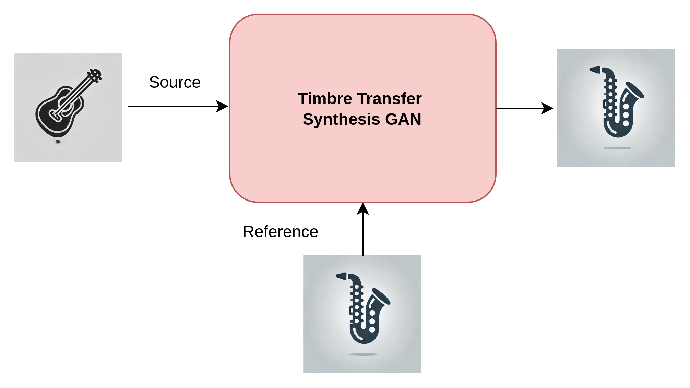
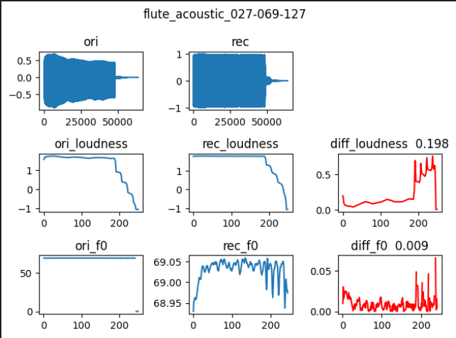
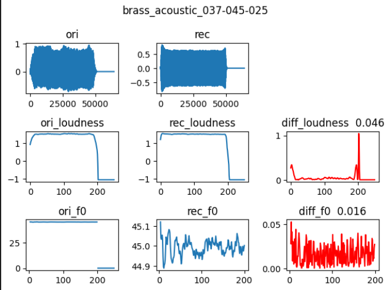
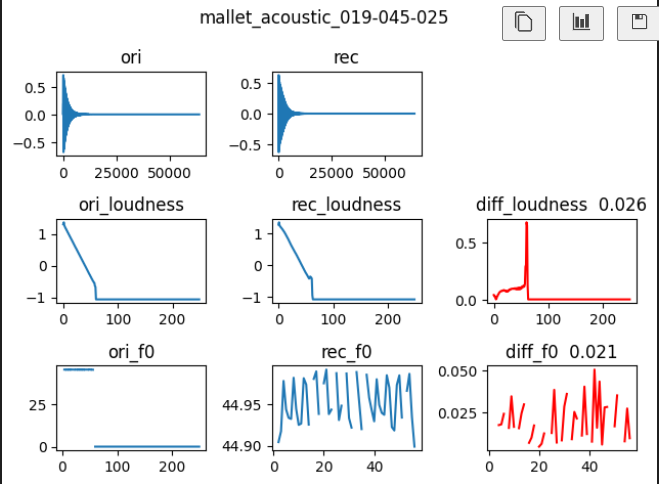
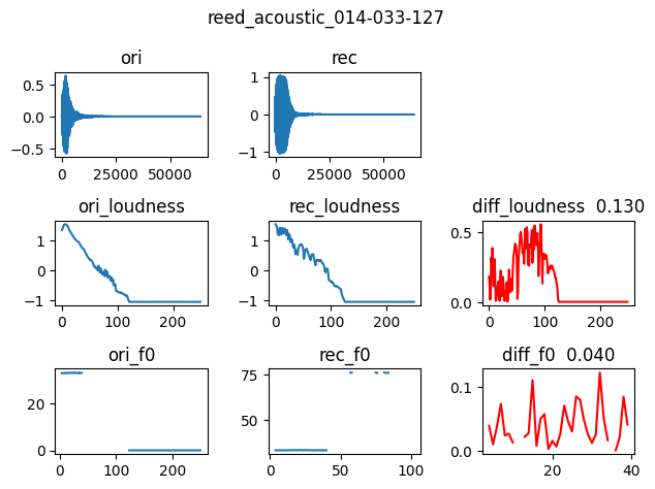

# TimbreTransformer — GAN-based Instrument Timbre Transfer

<p align="center">
  
</p>

**TimbreTransformer** is a GAN-based any-to-any instrument timbre transfer system built on Differentiable Digital Signal Processing (DDSP). Given a **source** audio and a **reference** audio of a different instrument, the model transfers the timbre of the reference onto the source while preserving pitch, loudness, and musical expression.

> Thesis: *Generative Adversarial Network Design for Instrument Timbre Transfer Application*
> (應用於樂器音色轉換之生成對抗網路設計)

---

## Key Features

- **Any-to-Any timbre transfer** — no retraining needed for new instrument pairs
- **DDSP-based synthesis** — interpretable signal generation via additive + subtractive + non-integer harmonic synthesis
- **Lightweight** — only **7.5M parameters**, comparable to DDSP (7M) and much smaller than WaveRNN (23M)
- **High-fidelity resynthesis** — Loudness L1 ≈ 0.08, F0 L1 ≈ 0.02 (MIDI scale)

---

## Model Architecture

<p align="center">
  
</p>

The model consists of four main components:

| Component | Role |
|---|---|
| **Source Encoder** | Extracts F0 (via pretrained CREPE), loudness (A-weighted), and energy (RMS) from source audio |
| **Timbre Encoder** | VAE-based encoder that extracts a timbre embedding (Timbre Z) from the reference audio's mel spectrogram |
| **Decoder** | Fuses source features with timbre embedding via GRU + Timbre Transformer (self-attention & cross-attention), outputs parameters for three synthesis heads |
| **DDSP Synthesizer** | Generates audio from Integer Harmonic + Non-Integer Harmonic + Filtered Noise components |

A **Multi-Period Discriminator (MPD)** from HiFi-GAN is used for adversarial training.

<details>
<summary><b>Decoder Architecture (click to expand)</b></summary>
<p align="center">
  
</p>
</details>

---

## Audio Demos

> **Note:** GitHub does not render `<audio>` tags natively. To listen, clone the repo and open the `.wav` files in the `assets/demo/` folder, or use the Gradio demo app.

### Timbre Transfer Examples

| | Source | Reference | Transferred |
|---|---|---|---|
| **1** | Mallet | Guitar | Mallet → Guitar |
| | [1_source_mallet.wav](assets/demo/1_source_mallet.wav) | [1_ref_guitar.wav](assets/demo/1_ref_guitar.wav) | [1_transform.wav](assets/demo/1_transform.wav) |
| **2** | String | Reed | String → Reed |
| | [2_source_string.wav](assets/demo/2_source_string.wav) | [2_ref_reed.wav](assets/demo/2_ref_reed.wav) | [2_transform.wav](assets/demo/2_transform.wav) |
| **3** | Flute | Brass | Flute → Brass |
| | [3_source_flute.wav](assets/demo/3_source_flute.wav) | [3_ref_brass.wav](assets/demo/3_ref_brass.wav) | [3_transform.wav](assets/demo/3_transform.wav) |

### Resynthesis Examples

| Original | Reconstructed |
|---|---|
| [resynthesis_ori.wav](assets/demo/resynthesis_ori.wav) | [resynthesis_rec.wav](assets/demo/resynthesis_rec.wav) |

---

## Evaluation Results

### Resynthesis Quality (vs. baselines)

| Model | Loudness L1 ↓ | F0 L1 ↓ | Params |
|---|---|---|---|
| WaveRNN | 0.10 | 1.00 | 23M |
| DDSP | 0.07 | 0.02 | 7M |
| **Ours** | **0.08** | **0.02** | **7.5M** |

Our model achieves resynthesis quality on par with DDSP while additionally supporting **any-to-any timbre transfer** — a capability DDSP does not have.

### Resynthesis Visualization

<p align="center">
  
  
</p>
<p align="center">
  
  
</p>

Each panel shows: waveform comparison (ori vs. rec), loudness / F0 difference, and mel spectrogram comparison.

---

## Dataset

Trained on the [NSynth](https://magenta.tensorflow.org/datasets/nsynth) subset (70,379 samples) from GANSynth, covering strings, brass, woodwinds, and percussion. All samples are 4-second single notes at 16 kHz, with MIDI pitch range 24–84.

---

## Quick Start

### Prerequisites

```
Python 3.8+, PyTorch, torchaudio, librosa, torchcrepe, gradio, wandb
```

### Data Preprocessing

```bash
cd data && python data_processor.py
```

### Training

```bash
python train.py
```

Training is logged to [Weights & Biases](https://wandb.ai/) under project `TimbreTransformer_v4`.

### Gradio Demo

```bash
# Resynthesis demo
cd app && python app.py

# Timbre transfer demo
cd app && python timbre_transfer_app.py
```

---

## Project Structure

```
timber_transfer/
├── components/
│   └── timbre_transformer/      # Core model (encoder, decoder, synthesizer)
├── data/                        # NSynth dataset & preprocessing
├── app/                         # Gradio demo apps
├── tools/                       # Training utilities, losses, visualization
├── train.py                     # Training script
├── validation.py                # Evaluation (Loudness L1, Pitch L1)
└── assets/                      # Architecture diagrams & audio demos
```

---

## License

This project was developed as a master's thesis research project.

## Acknowledgements

Built upon ideas from [DDSP](https://github.com/magenta/ddsp), [HiFi-GAN](https://github.com/jik876/hifi-gan), and [NVC-Net](https://github.com/sony/ai-research-code).
