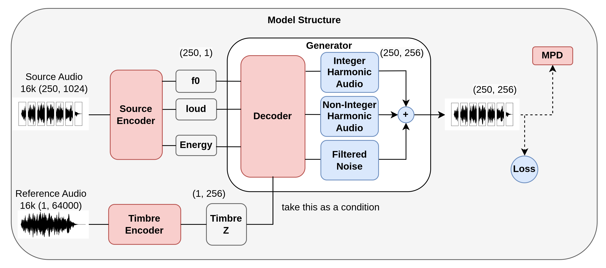

# Component Documentation

**English** | [繁體中文](./README.zh-TW.md)

This section expands the 4-component table in the main README into architecture-level docs.

## Global Architecture

## Read by Component

| Component | Design Goal | Doc |
|---|---|---|
| Source Encoder | Keep musical content (pitch, dynamics, articulation) stable during timbre transfer | [source-encoder.md](./source-encoder.md) |
| Timbre Encoder | Compress reference timbre into latent embedding with controllable stochasticity | [timbre-encoder.md](./timbre-encoder.md) |
| Decoder | Fuse source controls and timbre embedding into synthesis parameters | [decoder.md](./decoder.md) |
| DDSP Synthesizer | Convert predicted parameters into waveform using interpretable signal branches | [ddsp-synthesizer.md](./ddsp-synthesizer.md) |

## Reference Basis

These docs are aligned with:
- Thesis architecture design and chapter descriptions.
- Figures in `assets/architecture/` and `assets/architecture/components/`.
- Current implementation under `components/timbre_transformer/`.

## Training Objective Overview

The current training script (`train.py`) optimizes generator and discriminator as:

\[
\mathcal{L}_G =
\lambda_{\text{adv}}\mathcal{L}_{\text{adv}}^G +
\lambda_{\text{fm}}\mathcal{L}_{\text{fm}} +
\lambda_{\text{mel}}\mathcal{L}_{\text{mel}} +
\lambda_{\text{mfft}}\mathcal{L}_{\text{mfft}} +
\lambda_{\text{kl}}\mathcal{L}_{\text{kl}}
\]

\[
\mathcal{L}_D = \mathcal{L}_{\text{adv}}^D
\]

where weights \(\lambda_*\) come from `config.json -> loss_weight`.

### Adversarial (MPD, LSGAN-style)

\[
\mathcal{L}_{\text{adv}}^D = \sum_p \mathbb{E}\left[(1-D_p(x))^2 + D_p(\hat{x})^2\right]
\]
\[
\mathcal{L}_{\text{adv}}^G = \sum_p \mathbb{E}\left[(1-D_p(\hat{x}))^2\right]
\]

### Feature Matching

\[
\mathcal{L}_{\text{fm}} = 2\sum_{p,l} \left\lVert f_{p,l}(x) - f_{p,l}(\hat{x}) \right\rVert_1
\]

### Mel Spectrogram Reconstruction

\[
\mathcal{L}_{\text{mel}} = \left\lVert \text{Mel}(x) - \text{Mel}(\hat{x}) \right\rVert_1
\]

### Multi-Scale FFT

\[
\mathcal{L}_{\text{mfft}} = \sum_{s \in \mathcal{S}}
\left(
\left\lVert S_s(x)-S_s(\hat{x}) \right\rVert_1
+
\left\lVert \log S_s(x)-\log S_s(\hat{x}) \right\rVert_1
\right)
\]

### KL Regularization (Timbre VAE)

\[
\mathcal{L}_{\text{kl}} = \frac{1}{2}\,\mathbb{E}
\left[
\sum_d \left(e^{\log\sigma_d^2} + \mu_d^2 -1-\log\sigma_d^2\right)
\right]
\]

### Loudness/F0 Metrics in Current Code

- Loudness L1 is computed in `train.py` under `torch.no_grad()` for monitoring.
- Loudness L1 and Pitch L1 are primary evaluation metrics in `validation.py`.
