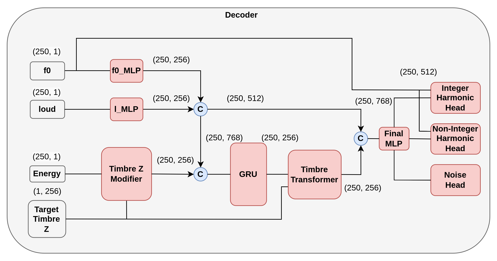
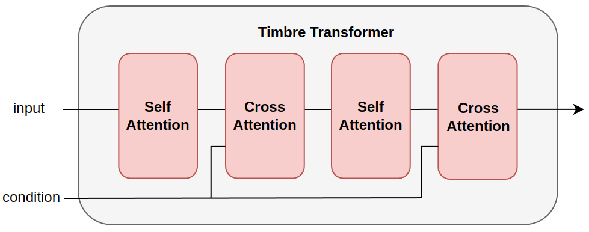
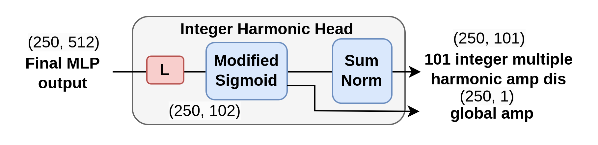
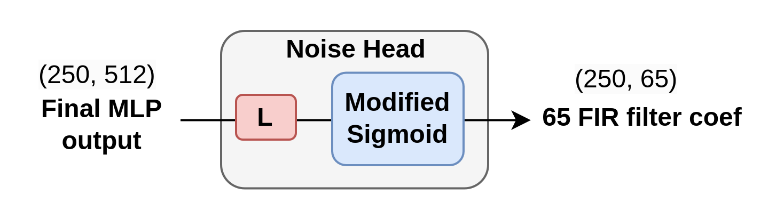
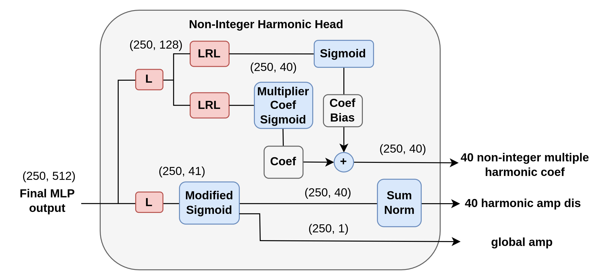

# Decoder

**English** | [繁體中文](./decoder.zh-TW.md)

## Architecture

### Timbre Transformer Block

## Design Intent

Decoder is the core fusion module: it injects timbre style into source controls and predicts synthesis parameters for waveform generation.

The design uses:
- Control stream encoders for `F0` and loudness.
- Timbre-Z refinement with energy-aware fusion.
- GRU temporal modeling.
- Self-attention and cross-attention for frame-wise style-content integration.

## Output Heads

### Harmonic Head (integer harmonics)

### Noise Head (filtered noise bank)

### Non-Integer Harmonic Head

## Implementation Mapping

- Active decoder entry:
  - `components/timbre_transformer/decoders/__init__.py`
  - currently exports `decoder_v21.Decoder`
- Main decoder logic:
  - `components/timbre_transformer/decoders/decoder_v21.py`
- Supporting fusion/attention blocks:
  - `components/timbre_transformer/utils_blocks/TCUB.py`
  - `components/timbre_transformer/utils_blocks/UFB.py`

## Tensor Interfaces

- Input:
  - `f0`: `(B, F, 1)`
  - `loudness`: `(B, F, 1)`
  - `energy`: `(B, F, 1)`
  - `timbre_emb`: `(B, 1, D)`
- Output:
  - `harmonic_output`: `(n_harm_dis, global_amp)`
  - `noise_output`: filter-bank magnitudes
  - `enhance_harmonic_output`: `(n_harm_dis, global_amp, enhance_coef)`
  - passthrough `f0` for synthesizer

## Parameter Constraints

`modified_sigmoid` is used in heads to keep amplitudes and filter magnitudes non-negative, which stabilizes DDSP synthesis.

## Mathematical Formulation

Let source controls be \(c_t=[f0_t, l_t, e_t]\) and timbre embedding be \(z\).
Decoder predicts frame-wise parameters:

\[
\theta_t = \{a_t, h_t, n_t, \tilde{h}_t, \tilde{a}_t, \alpha_t\}
\]

where:
- \(h_t\): integer harmonic distribution
- \(a_t\): global harmonic amplitude
- \(n_t\): noise filter-bank magnitudes
- \((\tilde{h}_t,\tilde{a}_t,\alpha_t)\): enhancement-branch parameters

Non-negative parameterization in code:

\[
\operatorname{msig}(x)=m\cdot \sigma(x)^{\log(e)}+\tau
\]

(`modified_sigmoid`, with default \(m=2, e=10, \tau=10^{-7}\)).

Normalized harmonic distribution:

\[
h_t \leftarrow \frac{h_t}{\sum_k h_{t,k} + \varepsilon}
\]

## Loss Coupling in Training

Decoder outputs are supervised indirectly through synthesized waveform \(\hat{x}\) via:
- adversarial loss (\(\mathcal{L}_{adv}^G\))
- feature matching (\(\mathcal{L}_{fm}\))
- mel reconstruction (\(\mathcal{L}_{mel}\))
- multi-scale FFT (\(\mathcal{L}_{mfft}\))

So decoder learns parameter quality by reducing waveform and spectral discrepancies rather than direct head-level labels.
