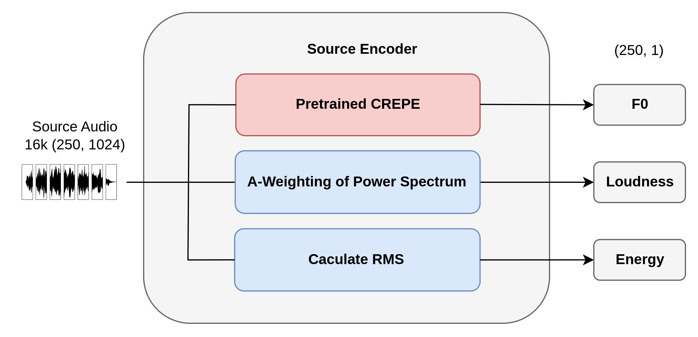

# Source Encoder

**English** | [繁體中文](./source-encoder.zh-TW.md)

## Architecture

## Design Intent

The source encoder is designed to preserve *what is played* (pitch contour and dynamics) while allowing timbre to change.

- `F0`: preserves melody and note trajectory.
- Loudness: preserves macro dynamics and envelope trend.
- RMS energy: provides a frame-level energy cue for decoder-side conditioning.

This separation follows the thesis objective of timbre transfer without collapsing musical expression.

## Data Flow

1. Offline/online feature extraction from source waveform.
2. Convert frame-wise controls into model-ready tensors.
3. Pass `F0`, loudness, and energy to decoder as source control stream.

## Implementation Mapping

- Pitch extraction (CREPE):
  - `components/timbre_transformer/utils.py`
  - `get_extract_pitch_needs`, `extract_pitch`
- Loudness extraction (A-weighted STFT power):
  - `components/timbre_transformer/utils.py`
  - `get_A_weight`, `extract_loudness`
- Runtime source encoder wrapper:
  - `components/timbre_transformer/encoder.py`
  - `Encoder.forward`, `EngryEncoder.forward`

## Tensor Interfaces

- Input:
  - `signal`: `(B, T)`
  - `loudness`: `(B, F)`
  - `f0`: `(B, F)`
- Output to decoder:
  - `f0`: `(B, F, 1)`
  - `loudness`: `(B, F, 1)`
  - `energy`: `(B, F, 1)`

## Why This Matters for Timbre Transfer

Without explicit source controls, decoder outputs can drift in pitch and dynamics. The source encoder makes the transfer task: keep source content, replace timbre style.

## Metric Coupling (Training/Validation)

Source controls are tied to evaluation targets:

$$
\mathcal{L}_{\text{loudness}} = \left\lVert l(x)-l(\hat{x}) \right\rVert_1
$$

$$
\mathcal{L}_{f0} = \text{mean}\left(\left|midi(f0(x)) - midi(f0(\hat{x}))\right|\right)
$$

Current code usage:
- `train.py`: loudness L1 is logged under `torch.no_grad()` (monitoring).
- `validation.py`: reports loudness L1 and pitch L1 as final metrics.
