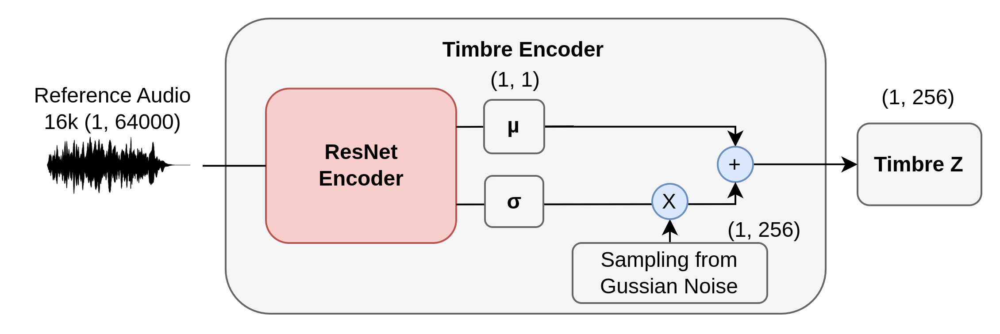
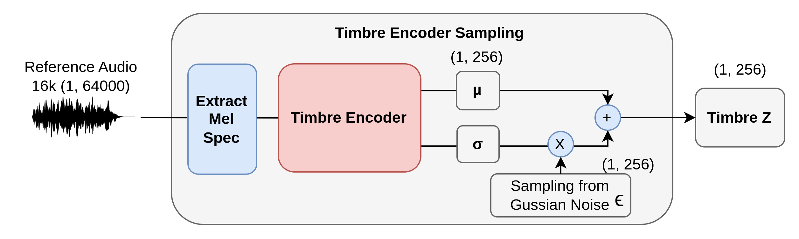

# Timbre Encoder（音色編碼器）

[English](./timbre-encoder.md) | **繁體中文**

## 架構圖

### VAE 取樣

## 設計動機

Timbre Encoder 會從 reference 音訊中提取 `Timbre Z`，並盡量與來源旋律分離。

- `mu`, `logvar` 描述潛在分佈
- 訓練使用 reparameterization 增加表徵彈性
- 推論使用 `mu` 以確保輸出穩定

## 程式碼對照

- 目前使用路徑
  - `components/timbre_transformer/encoder.py`
  - `TimbreEncoderX`
- 替代版本
  - `TimbreEncoder`
- 取樣實作
  - `components/timbre_transformer/TimberTransformer.py`
  - `TimbreTransformer.sample`

## Tensor 介面

- Input
  - `timbre_signal`: `(B, 1, T)` 或 `(B, T)`（依 pipeline）
- Output
  - `mu`: `(B, D, 1)`
  - `logvar`: `(B, D, 1)`
  - `timbre_emb`: `(B, 1, D)`

## 訓練與推論差異

- Training (`is_train=True`)
  - `z = mu + exp(0.5 * logvar) * eps`
- Inference (`is_train=False`)
  - `z = mu`

## 數學公式

\[
q_\phi(z \mid x_r) = \mathcal{N}(\mu_\phi(x_r), \operatorname{diag}(\sigma_\phi^2(x_r)))
\]

\[
\epsilon \sim \mathcal{N}(0, I), \quad
z = \mu + \sigma \odot \epsilon, \quad
\sigma = \exp(0.5\,\logvar)
\]

推論時使用 \(z=\mu\)。

## 與 loss 的關聯

主要受 KL 正則化約束：

\[
\mathcal{L}_{\text{kl}} = \frac{1}{2}\,\mathbb{E}
\left[
\sum_d \left(e^{\log\sigma_d^2} + \mu_d^2 -1-\log\sigma_d^2\right)
\right]
\]

此項有助於潛在空間平滑與音色泛化能力。
